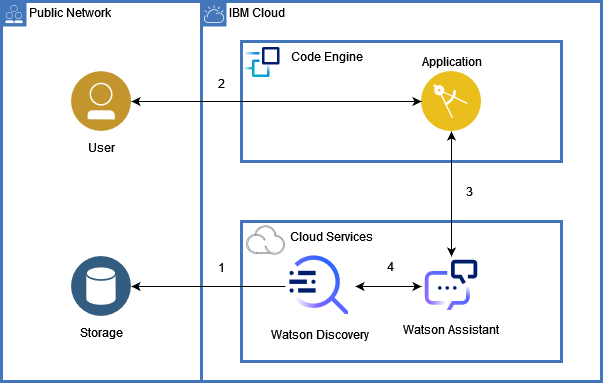

# Space Apps Challenge

    Team name: Los del espacio
    Team members: Martina De Leon, Sebastián Fripp, Juan Ignacio Prina, Bruno Quadrelli.
    Challenge: Can AI Preserve Our Science Legacy?

## Summary

We have develop a web page where you can make searches through a chatbot implemented with Watson Assistant and Watson Discovery services. The chatbot will be the manager of the search that a researcher may want, and Discovery will implement searches through the NTRS (NASA Technical Reports Server) documents. Watson Discovery is a useful tool which can help researchers to create cognitive applications that can extract great value from a huge amount of structured and unstructured documents. Our project is already useful but it is also scalable since we can continue training the Watson AI to obtain more appropriate responses, with the appropriate vocabulary and teaching new scientific concepts.

## Content

- [Space Apps Challenge](#space-apps-challenge)
  - [Summary](#summary)
  - [Content](#content)
  - [Our solution](#our-solution)

## Our solution

Our solution is fully developed in the IBM Cloud because we are using Code Engine to deploy our web page, Watson Assistant to manage the search and Watson Discovery to do the search through documents. Watson Discovery functionally is capable of tracking, converting, enriching and normalize data to bring better answers. It helps decrease search times and improve researchers productivity. We have uploaded 38 local documents about the subject category "Lunar and Planetary exploration" from the NASA Technical Reports Server (NTRS) to Watson Discovery, they can be from different data sources such as Salesforce, Box, IBM Cloud Object Storage, Sharepoint or a web crawl. The service ingest the documents with Natural Language Processing (NLP) that allows to convert and enrich through metadata to make more navegable and easy to explore. Then the NLP are normalized and cleaned through an automatic process to improve the data quality. This will allow the service to understand more quickly and give better answers.

We have trained our AI with the Smart Document Understanding (SDU) tool that allows us to classify in different fields how the documents ingested are organized, thus we can train convertible models.

You can test our solution if you [click here](https://nasa-challenge-app.oo3t70jm3ew.us-south.codeengine.appdomain.cloud).