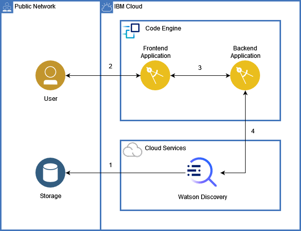

# Space Apps Challenge

    Team name: Los del espacio
    Team members: Martina de Leon, Sebastián Fripp, Juan Ignacio Prina, Bruno Quadrelli.
    Challenge: Can AI Preserve Our Science Legacy?

## Content

- [Space Apps Challenge](#space-apps-challenge)
  - [Content](#content)
  - [Meter un resumen](#meter-un-resumen)
  - [Architecture](#architecture)

## Meter un resumen

## Architecture
METERLE ONDA A LA PARTE DE LA ARQUI
The architecture for the solution we have created is the following: 

1. Upload to Watson Discovery all your documents.
2. A user search's some documents.
3. Request is sent to the backend application.
4. Backend application request Watson Discovery all documents that matches the criteria sent by the user.