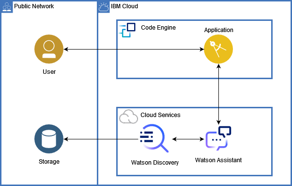

# Space Apps Challenge

    Team name: Los del espacio
    Team members: Martina de Leon, Sebastián Fripp, Juan Ignacio Prina, Bruno Quadrelli.
    Challenge: Can AI Preserve Our Science Legacy?

## Content

- [Space Apps Challenge](#space-apps-challenge)
  - [Content](#content)
  - [Our solution](#our-solution)
  - [Architecture](#architecture)

## Our solution
For the solution we have deployed both, frontend and backend application, in IBM Code Engine. We also have loaded some documents into the IBM Watson Discovery service for making the search experience

## Architecture
The architecture and the flow for the solution we have created is the following: 

1. Upload to Watson Discovery all your documents.
2. A user search's some documents in the frontend application.
3. Request is sent to the backend application.
4. Backend application request Watson Discovery all documents that matches the criteria sent by the user.