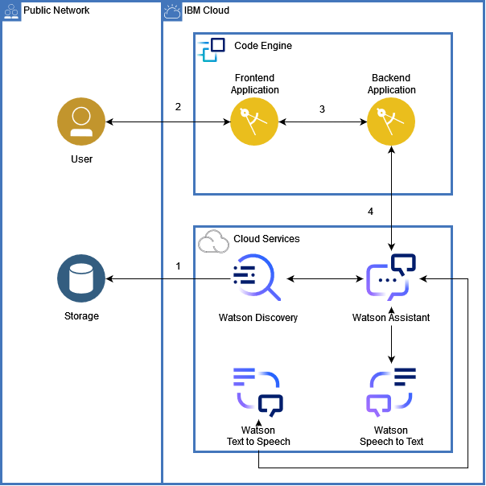

# Next steps

    Team name: Los del espacio
    Team members: Martina De Leon, Sebastián Fripp, Juan Ignacio Prina, Bruno Quadrelli.
    Challenge: Can AI Preserve Our Science Legacy?

## Content

- [Next steps](#next-steps)
  - [Content](#content)
  - [Future solution](#future-solution)

## Future solution

We hope in the not too distant future to have the integration of Speech to Text and Text to Speech, to have new alternatives when searching.
At the same time, we would like to include the option to download the documents that were found based on the query, by doing this, documents would be accessible from the same platform.

