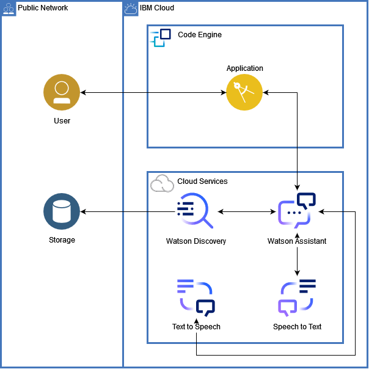

# Next steps

    Team name: Los del espacio
    Team members: Martina De Leon, Sebastián Fripp, Juan Ignacio Prina, Bruno Quadrelli.
    Challenge: Can AI Preserve Our Science Legacy?

## Content

- [Next steps](#next-steps)
  - [Content](#content)
  - [Future solution](#future-solution)
  - [Architecture](#architecture)

## Future solution
<!-- Esperamos en un futuro, no muy lejano, contar con la integración de Watson Assistant, Speech to Text y Text to Speech, para integrar nuevas formas de realizar las búsquedas, de forma innovadora  
de manera que todos las personas sean capaces de realizar las mismas. -->

## Architecture

Once created, the architecture and flow for the future solution would look something like this:

<!-- 1. sasd
2. 33
3. sds
4. sdsd
5. asd
6. asd
7. asd
8. asd -->